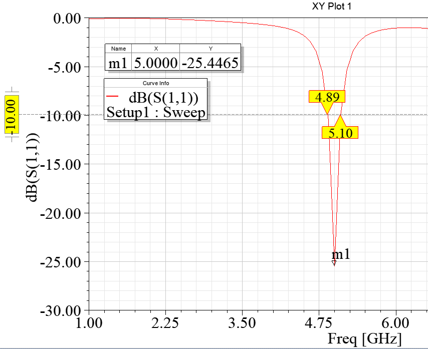

# 5-Ghz-antenna-using-FR-4
ANSYS HFSS design files for a 5 GHz microstrip patch antenna on an FR-4 substrate, optimized for Wi-Fi applications.
This repository contains the ANSYS HFSS simulation project for a compact U-slot microstrip patch antenna designed to operate at 5.0 GHz. The design is implemented on a standard FR-4 substrate and is optimized for C-band applications, including Wi-Fi (IEEE 802.11a/n/ac).

## Performance Summary

| Metric                  | Value                  |
| ----------------------- | ---------------------- |
| Resonant Frequency      | 5.0 GHz                |
| Return Loss (S11)       | -25.45 dB              |
| -10 dB Bandwidth        | 210 MHz (4.89–5.10 GHz)|
| Radiation Pattern       | Directional            |

### S11 (Return Loss)

The antenna achieves a return loss of -25.45 dB at its resonant frequency of 5.0 GHz

### Radiation Pattern

The E-plane and H-plane radiation patterns at 5.0 GHz demonstrate a directional main lobe.

## Antenna Dimensions

The antenna geometry is parameterized as follows, with all dimensions in millimeters (mm).

| Parameter                 | Dimension (mm) |
| ------------------------- | -------------- |
| Substrate Width (SW)      | 24.5           |
| Substrate Length (SL)     | 27.0           |
| Patch Width (PW)          | 17.0           |
| Patch Length (PL)         | 13.75          |
| Feedline Width (FW)       | 3.11           |
| Feedline Length (FL)      | 8.05           |
| U-Slot Cut Width (CW)     | 1.0            |
| U-Slot Cut Length (CL)    | 4.5            |

.png)
## Project Files

*   **Project1.aedt**: The ANSYS Electronics Desktop project file.
*   **LICENSE**: The repository license.
*   **README.md**: This documentation file.

## License

This project is licensed under the MIT License. See the `LICENSE` file for details.

---
Copyright (c) 2025 Shreeraj Patil
